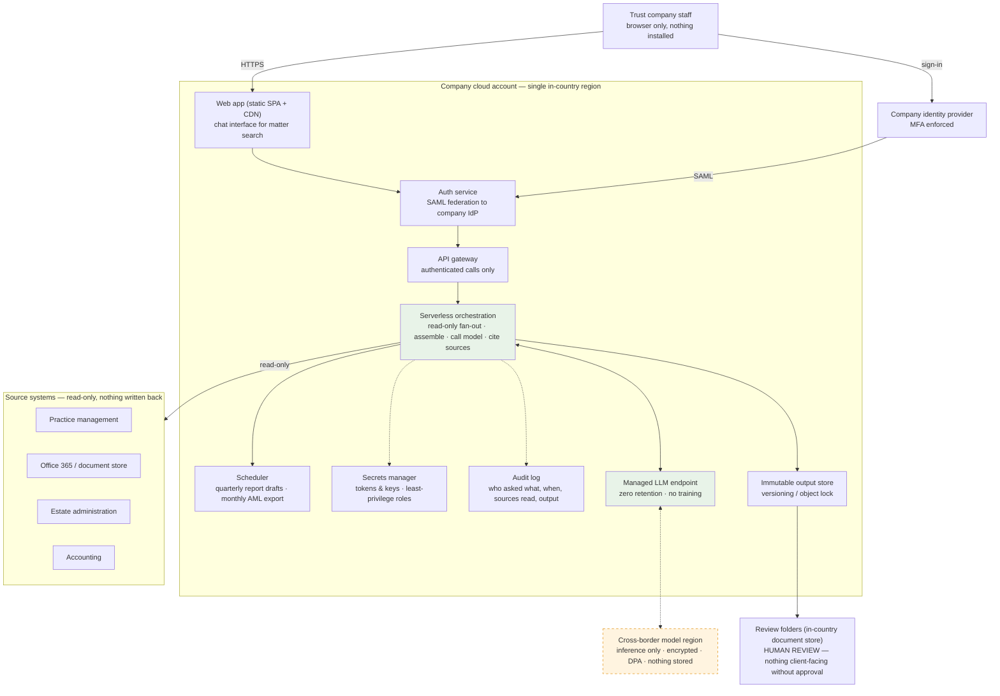
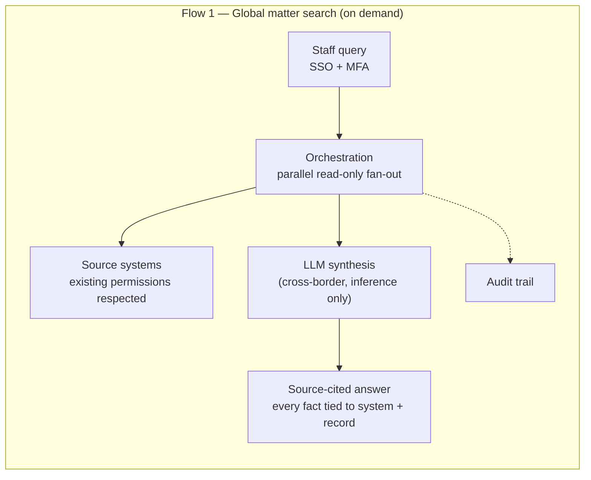
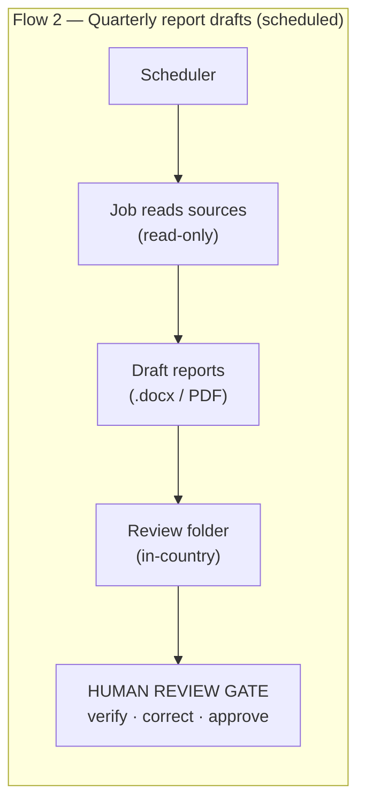
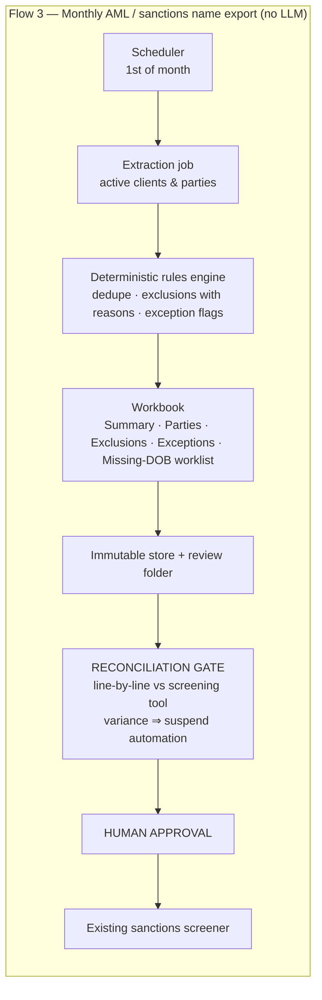

# Example 01 — Serverless AI Integration Platform (Proof of Concept)

**Contributed by a trust company that built and ran this as a proof of concept.** Shared as a *starting point*: alternate approaches and suggestions for improvement are welcome — open an [issue](../../../../../issues) or see [Contributing](../../../CONTRIBUTING.md).

Client and vendor identifiers have been removed. Original diagrams: [architecture (PDF)](architecture-diagram.pdf) · [data flow (PDF)](data-flow-diagram.pdf). The Mermaid versions below are redrawn from them so they can be edited as text.

## What it does

Three use cases, all inside the company's own cloud account in a single in-country region:

| # | Use case | Trigger | Uses an LLM? |
| --- | --- | --- | --- |
| 1 | **Global matter search** — staff ask a plain-language question and get a source-cited summary across practice management, document store, estate administration and accounting systems | On demand, by staff | Yes (inference only) |
| 2 | **Quarterly matter status & financial report drafts** — per-matter draft reports placed in a review folder | Scheduled | Yes (drafts only) |
| 3 | **Monthly AML / sanctions screening name export** — deterministic extraction of active client and party names for the existing screening tool | Scheduled, 1st of month | **No** |

## Design choices worth copying

- **Read-only everywhere.** Source systems are systems of record; nothing is written back. Existing user permissions are respected.
- **Data residency is explicit.** All compute, storage, secrets, logs and outputs stay in one in-country region. The *only* cross-border flow is the matter-search inference call, which is encrypted in transit, covered by a data-processing agreement, and runs under zero-data-retention / no-training terms. The diagram marks it in a different colour so an examiner can see it at a glance.
- **Staff use the sign-in they already have.** Company identity provider federated into the platform; MFA enforced; browser only, nothing installed.
- **Every request is audited.** Who asked what, when, which sources were read, what was generated. Outputs are stored immutably (versioning / object lock).
- **Humans decide.** Report drafts land in a review folder and nothing goes to a client without staff review. The AML export has a *reconciliation gate* (line-by-line check against the screening tool; any variance suspends automation) and a *human approval* step before upload.
- **No LLM where determinism matters.** The AML export is rules-only. Names and dates of birth never leave the country; national ID numbers are excluded from the export entirely.
- **Secrets and least privilege.** All tokens and keys in a managed secrets store; least-privilege roles throughout.

## Architecture (redrawn)

## Data flows (redrawn)

## Open questions for peers

Things the contributing firm — and this forum — would like alternate views on:

1. Is an inference-only cross-border call acceptable to your regulator, or do you require in-country model hosting?
2. How do you handle retrieval permissions when the source system's entitlement model is coarser than the question being asked?
3. What evidence do examiners actually ask for from the audit trail — and does immutable storage of *outputs* suffice, or must prompts be retained too?
4. Would you put the AML export on a fully separate pipeline (different account / roles) from the LLM workloads?

Reply via an issue, or propose a change to this file.
