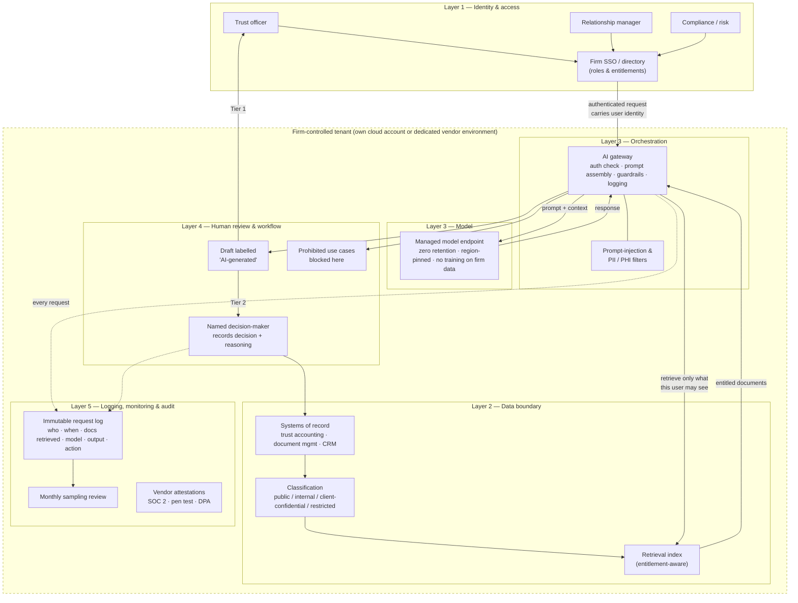

# Reference Architecture — Diagram

Companion to [Framework 01](../frameworks/01-reference-architecture.md). The diagram is Mermaid; GitHub renders it automatically. Edit the text to change the diagram.

## Logical view

## Reading the diagram

- **Everything inside the dashed box is the firm's.** Even if a vendor operates it, the tenant is isolated and the logs are the firm's.
- **The model never talks to users directly.** All traffic goes through the gateway, which is where entitlements, guardrails and logging live.
- **Retrieval is entitlement-aware.** The index knows which user may see which document; the gateway asks on the user's behalf.
- **Two exits from the gateway:** a labelled draft (Tier 1), or a draft that goes to a named decision-maker who writes the decision back to the system of record (Tier 2). Prohibited cases are stopped at the gateway.
- **Logs are dotted lines** because they are a side effect of everything, not a step in the flow.

## Deployment variants

The logical view is the same in each; only who operates the boxes changes.

| Variant | Who runs Layers 2–3 | Typical fit |
| --- | --- | --- |
| **Own cloud** | Firm's IT, using a cloud provider's managed model service inside the firm's account | Firms with an existing cloud footprint and at least one engineer |
| **Dedicated vendor tenant** | Vendor, in an environment isolated per customer | Most trust companies; requires strong contract terms on data, logs and model training |
| **Hybrid** | Firm keeps data boundary and logs; vendor provides orchestration + model | Firms that want control of data without building a platform |

Shared-tenant SaaS where client data is commingled with other customers' data is **not** a variant of this architecture.
